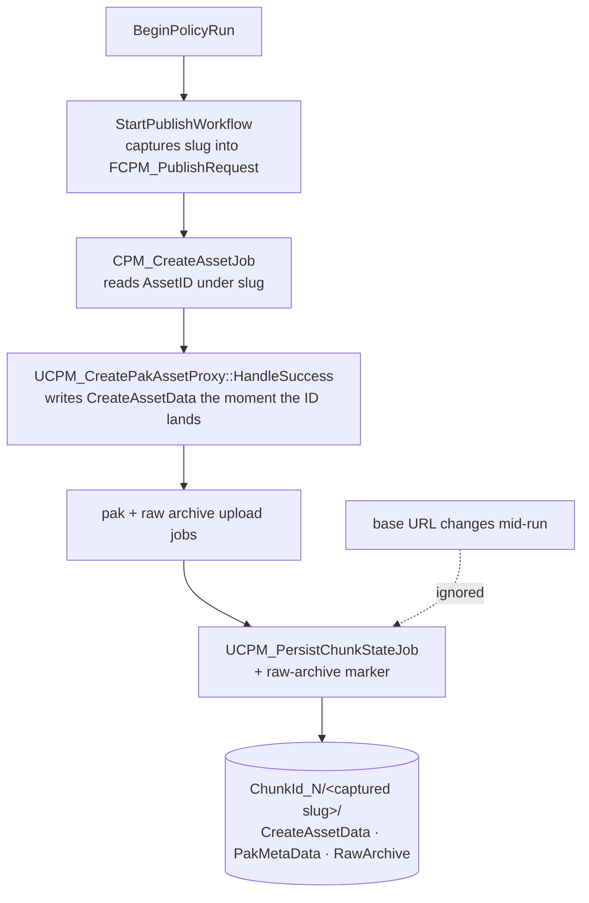
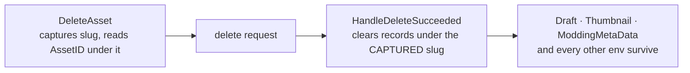
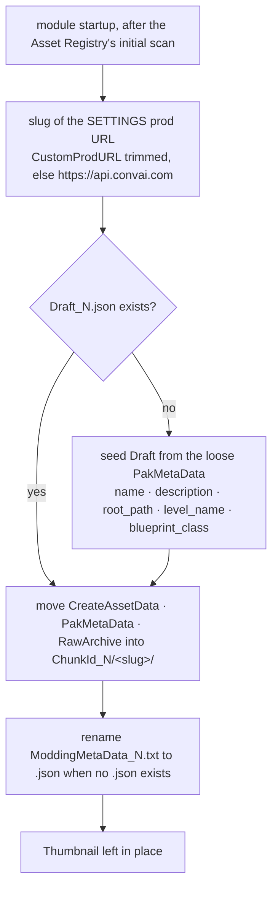

# Asset Uploader: handle different backend environments

## Problem

The Pak Manager records the published Asset in the creator's project, but nothing in that record
says which backend it was published to. Point the project at a different environment and the same
files are read back, so a stg AssetID gets sent to prod — updating or deleting the wrong Asset.

## Layout

Anything the server minted moves under the Environment it came from. Creator-authored inputs are the
same for every backend, so they stay at chunk level.

```
ConvaiEssentials/ChunkId_0/
  ModdingMetaData_0.json   project, plugin, asset type   (chunk level; renamed from .txt, .txt still read)
  Draft_0.json             name, description, entry point (chunk level; new)
  Thumbnail_0.png          creator's screenshot           (chunk level)
  Env_api.convai.com_29e2cb96/
    CreateAssetData_0.json  the AssetID                   (per env)
    PakMetaData_0.json      server metadata cache         (per env)
    RawArchive_0.txt        'this backend has the source' (per env)
```

`Draft_<N>.json` is new because UI Save writes into `PakMetaData` today, and `PakMetaData` is also
the server's document. Partitioning it per Environment as-is would blank the creator's name,
description and entry point on every switch. Save goes to the Draft; `PakMetaData` becomes the
server-derived cache it was always meant to be, composed from Draft + response at publish time.

## The slug

```
Env_<segment>_<hash>
```

| Part | Rule |
|---|---|
| canonical URL | scheme and host lowercased, path case kept, trailing `/` stripped |
| `segment` | authority + path of the canonical URL, every char outside `[A-Za-z0-9.]` replaced by `-`, first 24 chars |
| `hash` | first 8 hex of lowercase MD5 over UTF-8 of the canonical URL |

The hash is the identity; the segment is for the human reading their own folder. Derived from the
resolved base URL at the moment a request is built — never configured, so custom URLs work for free
and no setting can name a backend the bytes never reached.

Pinned (verified by computation, not by eye):

| Base URL | Slug |
|---|---|
| `https://api.convai.com/` | `Env_api.convai.com_29e2cb96` |
| `https://api-preview.convai.com/` | `Env_api-preview.convai.com_a37055b4` |
| `https://api-stg.convai.com/` | `Env_api-stg.convai.com_64b86207` |
| `https://gateway.example.com/convai` | `Env_gateway.example.com-conv_b18ab04b` |
| `http://localhost:8000` | `Env_localhost-8000_70490311` |

Host case and a trailing slash fold to one slug. Path case does not.

## Publish

The slug is captured once, when the request is built, and carried down. A mid-publish environment
switch records where the run started — it never refuses. A guard that failed the job would leave the
Asset created on the server with no local record at all, which is worse than the mis-file it
prevents.



The eager write in `HandleSuccess` stays where it is: it holds the orphan window to sub-second
rather than a whole multi-GB upload.



## Migration

Nothing has shipped, so every existing loose record is prod by definition.



Move, never copy, never delete. A file whose destination already exists is skipped with a warning —
an environment that has already published is never overwritten. The slug comes from the **settings**
URL only: reading `-ConvaiBetaURL=` off the command line would let one CI launch file a prod record
under stg permanently.

The legacy flat migration keeps finding `ModdingMetaData.txt` and renames it as it moves. The read
side looks for `.json`, falls back to `.txt` — the Modding Tool writes that file, not us, so a newly
generated project keeps working until it catches up. The fallback comes out after it has.

## Also in scope

- All four endpoints pass `bUseBeta=true` today, so we publish to beta and the *Custom Production
  API URL* setting cannot move them. Flipped to false.
- The publish path reads the AssetID through `GetSoleChunkId()` while the UI reads it per Chunk.
  Both sides go chunk-aware in the same commit — fixing one alone makes every publish create a fresh
  Asset. The now-tautological cross-check in `GetRawArchiveUploadTime` goes with it.
- The Raw Project Archive keeps the env folders, so Convai can repackage the same project to another
  environment later and needs those AssetIDs. `Thumbnail_*.png` and `RawArchive_*.txt` stay excluded
  from the zip.

## Accepted tradeoffs

- **Downgrade is one-way.** An older plugin reads the old locations and shows Draft.
- **`:443`, `www.` and http-vs-https on one host each get their own folder.** A visible duplicate,
  never a silent crossover — which is the trade being bought.
- **`ModdingMetaData` carries the creator's api_key and travels in the zip.** Only Convai can read
  those uploads, and the key is already in `DefaultEngine.ini`, which the zip also carries.

## Verification

```
E:\Software\UE_5.8\Engine\Build\BatchFiles\Build.bat Dev_CPM_58Editor Win64 Development ^
  "E:\UEProjects\UE5.8\Dev_CPM_58\Dev_CPM_58.uproject" -WaitMutex
```

```
E:\Software\UE_5.8\Engine\Binaries\Win64\UnrealEditor-Cmd.exe ^
  "E:\UEProjects\UE5.8\Dev_CPM_58\Dev_CPM_58.uproject" ^
  -nopause -NullRHI -unattended -nosplash -stdout -NoLogTimes ^
  -TestExit="Automation Test Queue Empty" -ReportExportPath="<scratch>\automation" ^
  -ExecCmds="Automation RunTests ConvaiPakManager.; Quit"
```

No editor may be running for the build. Read `<scratch>\automation\index.json`, or the
`Test Completed. Result=` lines in `Saved/Logs/Dev_CPM_58.log`.
