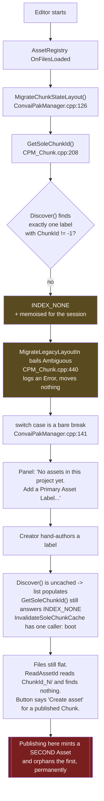

# Legacy parity: what the Blueprint uploader did that the Slate tool does not

Status: `ready-for-agent`

The Slate rewrite (`3526d98 refactor!: delete the Blueprint tool and collapse to one editor module`)
dropped the Editor Utility Widget `Content/Editor/AssetUploader.uasset` and, with it, a set of
behaviours nothing replaced. On a real pre-Chunk creator project the tool is now a dead end: it
refuses to migrate, offers no way to unblock itself, and publishes Avatars that do not work.

This register is the diff. It was produced against a live legacy project
(`E:\Downloads\LegacyUploader`, Modding Plugin `A3CLP672QMGL73V5F2KH`, `asset_type: Avatar`,
`is_metahuman: true`) by reading the legacy EUW's graphs out of a running editor over MCP and the
legacy C++ modules off disk, then auditing this repo for each behaviour. 29 gaps confirmed by an
adversarial second pass, 2 claims refuted and dropped.

---

## The boot dead end



Two separate mechanics produce the reported "UI gets stuck":

1. **No label, no migration, no way out.** Above. A hand-authored label defaults `ChunkId` to `-1`,
   so `Discover()` skips it entirely (`CPM_Chunk.cpp:171-176`) and even the recovery attempt fails.
2. **Nothing re-reads Chunks when the registry finishes scanning.** A tab restored by the editor's
   saved layout constructs mid-scan, `Discover()` returns a partial answer, and the panel sits on
   "no Chunks" until the creator clicks away and back — the only other refresh trigger is
   `OnTabActivated` (`ConvaiPakManager.cpp:82-88`). Discovery is also synchronous on the game thread
   and force-loads every label package (`CPM_Chunk.cpp:164`) on every one of those refreshes.

---

## The four named problems

### 1. Legacy `ConvaiEssentials` never migrates, and the tool cannot mint the Chunk it needs

**Legacy:** the EUW's `Construct` ran `CreatePAL` unconditionally — probe the Asset Registry for
`/<plugin_name>/PAL_<plugin_name>`, and on a miss run `Scripts/create_primary_asset_label.py`
(`bLabelAssetsInMyDirectory`, `bIsRuntimeLabel`, `Priority=0`, **`ChunkId=10`**, `bApplyRecursively`,
`AlwaysCook`) and save it. A creator never learned what a Primary Asset Label was.

**Now:** nothing constructs one. The script still ships at `Scripts/create_primary_asset_label.py`
and `UCPM_UtilityLibrary::GetPythonScriptDirectory` (`CPM_UtilityLibrary.cpp:400`) still exists —
both with zero callers, and the `.uplugin` no longer depends on `PythonScriptPlugin`, so the script
is unreachable even in principle. `CanAddAnotherChunk()` (`ConvaiPakEditorSubsystem.cpp:90`) and
`MaxChunksPerProject` are orphaned for the same reason: nothing creates a Chunk.

**To build:**
- `Chunk::EnsureLabel(MountRoot, ChunkId)` in `Chunk/CPM_Chunk.cpp` — native `IAssetTools::CreateAsset`
  + `UDataAssetFactory(SupportedClass=UPrimaryAssetLabel)`, the rules above, `SaveLoadedAsset`. Delete
  the Python script and `GetPythonScriptDirectory` with it.
- Register the label's mount root in `UAssetManagerSettings::PrimaryAssetTypesToScan` +
  `UpdateSinglePropertyInConfigFile`, idempotently. The Modding Tool used to write this into
  `DefaultGame.ini`; a standalone label in an unscanned directory cooks into chunk 0 and emits no
  `pakchunk<N>` at all.
- A `CreateChunk` Command and a button in both empty states, gated on `CanAddAnotherChunk()`.
- Re-run migration whenever the label set changes — `InvalidateSoleChunkCache()` then
  `MigrateChunkStateLayout()`. Its header already says to call it; boot is the only caller.
- Fall back to the flat `ConvaiEssentials/ModdingMetaData.txt` when no per-Chunk copy exists
  (`GetModdingMetadataPathIn`, `CPM_Chunk.cpp:331`) — three lines, and it makes an un-migrated
  project readable instead of resolving `ChunkId_-1/ModdingMetaData_-1.json` and logging an Error on
  every call. Today that empty read makes `GetAssetType()` return `Max`, which the detail panel reads
  as Scene (`SCPM_AssetDetailPanel.cpp:189`).
- Surface the outcome. `Ambiguous`/`Failed` are a bare `break;`. A creator with a live published
  Asset sees a clean "Create asset" form; clicking it orphans the Asset forever. Banner, not toast,
  and gate the primary button while it stands.

This resolves the CONTEXT.md flagged ambiguity *"Whether the Pak Manager can mint a Chunk"* — the
answer is now yes.

### 2. MetaHuman Avatars publish with no Convai animation blueprints

**Legacy detection** (`CheckAssetIsMetaHuman`, verified node-by-node): walk the blueprint's SCS
subobjects and return true on the first where all three hold — variable name `Contains("body")`
case-insensitive, the template casts to `USkeletalMeshComponent`, and `GetPathName` of that mesh's
`Skeleton` `Contains("metahuman")` case-insensitive.

**Legacy assignment** (`AssignAnimationBPToMH`): same walk, two branches per node.

| Component | Match | Assign when | Class |
|---|---|---|---|
| Body | name contains `body` | `AnimClass` is not valid | `/ConvAI/MetaHumans/Animations/Convai_MetaHuman_BodyAnim.Convai_MetaHuman_BodyAnim_C` |
| Face | name contains `face` | `AnimClass` is not valid **or** its display name is exactly `Face_AnimBP_C` (case-sensitive) | `/ConvAI/MetaHumans/Animations/Convai_MetaHuman_FaceAnim.Convai_MetaHuman_FaceAnim_C` |

A creator's own anim BP is never overwritten. Both assets verified present in the SDK checkout;
both projects mount the plugin as `/ConvAI/` (the `.uplugin` is `ConvAI.uplugin` in each), but
resolve via `IPluginManager::FindPlugin("ConvAI")->GetMountedAssetPath()` rather than hardcoding —
`ConvaiSetupToolset.cpp:46` in the SDK hardcodes `/Convai/` and disagrees with itself.

**Now:** absent. Nothing in this plugin ever loads an Entry Point blueprint, walks components, or
touches a skeleton — `SetEntryPoint` does an `FAssetData` class check and writes the package name to
the Draft as a string. `is_metahuman` is never written, read, or derived; it survives migration
byte-for-byte and nothing consumes it. Legacy ignored it identically, so detect by scanning, do not
trust the field.

**To build:** an `IsMetaHuman(UBlueprint*)` helper plus the fix-up, one SCS walk, in
`ConvaiPakEditorSubsystem.cpp` off the Avatar branch of `SetEntryPoint` (~`:344`). Use
`USimpleConstructionScript::GetAllNodes()` / `USCS_Node::ComponentTemplate` — **not**
`USubobjectDataSubsystem`, whose module is not a dependency. Report the outcome through the
`EntryPointError` slot that already exists (`SCPM_AssetDetailPanel.cpp:535-546`), including the case
legacy swallowed silently: detected a MetaHuman but the Convai anim BP class would not load.

### 3. Avatar blueprints publish without the Convai components

**Legacy** (`ConfigureAvatarForUpload` → `CheckAndAddComponent` ×2): checked and added the chatbot
component and `UConvaiFaceSyncComponent`, added via `AddNewSubobject` on the root handle, then
compiled and saved. A creator could pick a bare Actor blueprint and get back a working Convai avatar.

**Legacy got the chatbot case backwards** and this rewrite should not copy it: the check was
`ClassIsChildOf`, so a blueprint holding the raw C++ `UConvaiChatbotComponent` satisfied it, nothing
was added, and the Avatar shipped without the BP wrapper's action-dispatch and movement helpers.

**Now:** absent entirely — no component inspection, no addition, no reference to any Convai
component class. `FCPM_AssetViewModel::ValidationMessages` only tests `EntryPoint.IsEmpty()`, so an
Avatar blueprint with zero Convai components badges as "Ready to publish".

**Rule to implement**, in that order:

```
has BP_ConvaiChatbotComponent            -> ok
else has raw UConvaiChatbotComponent     -> ERROR, refuse, do not fix
else                                     -> add BP_ConvaiChatbotComponent
has UConvaiFaceSyncComponent             -> ok, else add
```

Membership must check **both** the SCS nodes and the generated class CDO's components — a component
declared natively by a C++ parent never appears in the SCS. Compile and save once at the end, not
once per component. Run the same helper again from `BeginPolicyRun` before a Publish or Package is
accepted: pick-time only catches the pick, and a creator can delete the component afterwards.

### 4. The Entry Point is not required to live in the Modding Plugin

**Legacy:** every pick was copied into `/<plugin_name>/` and then asserted with `AssetIsInPlugin`;
a failure cleared the picked-asset field with "Put asset in `<PluginName>` plugin".

**Now:** `SetEntryPoint` validates that the package exists and that its class matches the Asset Type.
`Modding.PluginName` is read into scope at `:301` and never used. Any `/Game/...` package of the
right class is accepted. The tool already bounds the *destructive* delete by the mount root
(`DeletePluginContent`, `:1082-1103`, "Refused rather than guessed") — so today it can publish an
Entry Point that its own "also delete the content I added" cannot reach.

**To build:** `IsUnderModdingPlugin(PackageName, PluginName)` beside the other Chunk path helpers —
`StartsWith("/" + PluginName + "/")`, not the legacy `Contains` (which passed `/Game/pluginname_old/`).
Empty `PluginName` must pass: CONTEXT.md says a Modding Plugin is a convention, not part of what a
Chunk is, and internal projects label `/Game` directly. Testable as a string predicate with no Asset
Registry.

---

## Gap register

29 confirmed. Severity is "does a creator get a broken Asset or a dead tool" (blocker), "the tool is
materially worse than the one it replaced" (major), or "polish" (minor).

### Bootstrap and migration

| # | Gap | Sev |
|---|---|---|
| 1 | Create the Chunk's Primary Asset Label when the project has none | blocker |
| 2 | Give the creator a way to mint the first Chunk from the panel | blocker |
| 3 | Register the label's directory in `AssetManagerSettings.PrimaryAssetTypesToScan` | blocker |
| 4 | Retry the legacy-layout migration when the project gains its first Chunk | blocker |
| 5 | Re-run migration when the Chunk set changes, not once per editor session | blocker |
| 6 | Surface the migration outcome — a refused migration is invisible outside the log | blocker |
| 7 | Re-read Chunks when the Asset Registry finishes its scan | major |
| 8 | Tell the creator when a legacy layout could not be migrated | major |
| 9 | Read the flat `ConvaiEssentials/ModdingMetaData.txt` when no per-Chunk copy exists | major |
| 10 | Give a legacy project with no label a way back (recover, don't reopen "+ New asset") | major |
| 11 | Carry the legacy raw-archive history across migration instead of re-uploading the project | minor |

### Avatar correctness

| # | Gap | Sev |
|---|---|---|
| 12 | Detect whether an Avatar's Entry Point blueprint is a MetaHuman | blocker |
| 13 | Assign the Convai body and face animation blueprints to a detected MetaHuman | blocker |
| 14 | Ensure the Entry Point carries `BP_ConvaiChatbotComponent` and `UConvaiFaceSyncComponent` | blocker |
| 15 | Refuse an Avatar carrying the raw C++ `UConvaiChatbotComponent` instead of the BP subclass | blocker |
| 16 | Re-check components when a Publish or Package is accepted, not only at pick time | major |
| 17 | Tell the creator the anim BPs were wired, or why they were not | minor |

### Entry Point scope

| # | Gap | Sev |
|---|---|---|
| 18 | Refuse an Entry Point outside the Modding Plugin's mount root | blocker |
| 19 | Offer to relocate an out-of-plugin pick — `CPM_DependencyCopyAPI` exists, nothing calls it | major |
| 20 | Show the Entry Point's dependencies that fall outside the Modding Plugin | major |

### Dropped in the rewrite

| # | Gap | Sev |
|---|---|---|
| 21 | Gate publish on thumbnail *content*, not just on the file existing (`CPM_IsThumbnailValid` is orphaned) | major |
| 22 | Let a creator use a texture they authored as the thumbnail | major |
| 23 | Capture an Avatar thumbnail by rendering the avatar, not by grabbing the level viewport | major |
| 24 | Restore the plugin self-update check that can stop an outdated uploader | major |
| 25 | Warn when the project's engine version is not the one Convai targets | major |
| 26 | Show the creator what will be dragged into the Pak | major |
| 27 | Make the post-UAT "a Pak exists" check prove the Pak was built by *this* run | major |
| 28 | Turn Live Coding off before handing the project to UAT | minor |
| 29 | Say in the tool that `ConvaiEssentials` must not be moved or deleted | minor |

### Refuted — do not re-raise

- **Linux cross-compile toolchain provisioning.** Wrong layer, and already stronger elsewhere. The
  Modding Tool's Python installer reads `toolchain_versions` / `toolchain_download_urls` /
  `environment_variable: LINUX_MULTIARCH_ROOT` from its own config, downloads and runs the installer
  when absent, writes the env var to HKLM (falling back to HKCU) and hard-blocks project create and
  migrate when it fails — where legacy's in-plugin `SanityChecking` only opened a download URL. The
  remote `asset_uploader_config.json` also ships `"linux": {"should-package": false}`, so
  `FCPM_PublishPolicy::Defaults()` is never the effective policy. `CPM_Set/GetSystemEnvVar` really are
  orphaned; that is dead code to delete, not a feature to restore. See also board #254, #257.
- **Force "Show Plugin Content" on when the panel opens.** The helper is dead code, but the premise
  is false: UE 5.8 ships `DisplayPluginFolders=True` in `BaseEditorSettings.ini`, and
  `SContentBrowser::CreateEditorConfigIfRequired` seeds each browser instance from that global. There
  is nothing to turn on.

---

## Still unexamined

Named here so the next pass does not have to rediscover them:

1. **The Scene path is entirely unaudited.** Every gap above is Avatar-only. Legacy `AssetIsScene`,
   `SceneIsValid` (which required a tagged spawn point in the loaded level) and `GetNumSubobjectInAsset`
   have no counterpart in this register.
2. **The wire payload was never diffed field-for-field.** Legacy `GetCreateMetaData` (97 nodes) and
   `GetUpdateMetaData` (67 nodes) versus `FillRequiredMetadataFields` / `ComposePakMetadataAt`
   (`CPM_Chunk.cpp:700-895`). A silent mismatch here corrupts every published record.
3. **`assets/get` is dead.** `UCPM_GetAssetMetaDataProxy::GetAssetProxy` (`CPM_Proxy.cpp:303`) has no
   caller; legacy refreshed the local echo after every create/update/raw upload. What goes stale?
4. **Dead-helper census.** `CPM_LoadAssetByPath`, `CPM_LoadClassByPath`, `CPM_LoadAssetDataByPath`,
   `CPM_IsThumbnailValid`, `CPM_GetFileSize`, `GetPackageDependencies`, `AnalyzePackageDependencies`
   all have zero callers. That set is the fingerprint of the dropped legacy validation graphs — walking
   it is a mechanical way to finish this register rather than guessing.
5. **`PickedAssetIsValid` (38 nodes) is only half mined** — the asset-is-actor branch, the subobject
   count check and two path-split checks were never enumerated, so "what makes a pick valid" is still
   partly unknown.
6. **`CPM_ChunkMigrationTest.cpp` passes** next to a migration that demonstrably does not run. Which
   precondition does the test fake? Cheapest read left.
