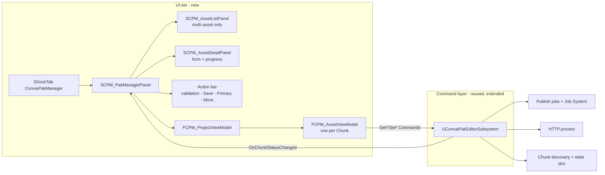
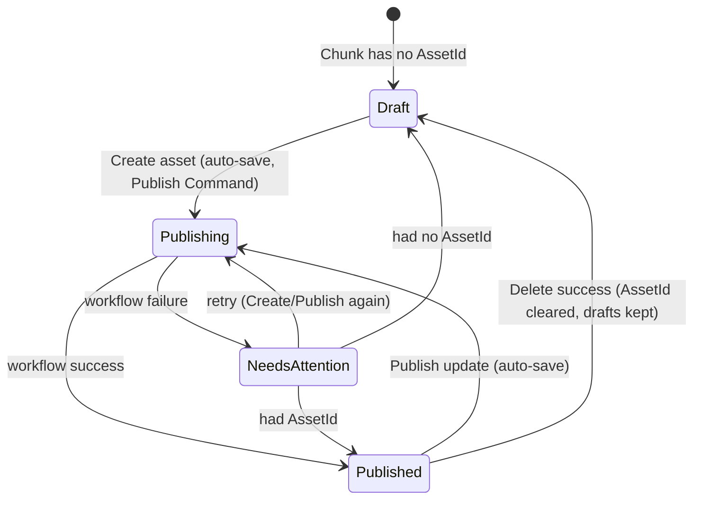

# Slate UI rebuild — finalized design

Status: **Accepted** — grilled and signed off 2026-08-27. This document is the implementation
contract. If the implementing agent (or a future session) picks this up cold, this file plus
`Context/Refactor/` (handoff, spec, mockup) and `CONTEXT.md` is everything needed. Where this
document and the handoff disagree, this document wins — every deviation below was explicitly
decided with the user.

Sources of truth, in priority order:

1. This document (decisions + contracts).
2. `Context/Refactor/convai-pak-manager-implementation-handoff.md` (product).
3. `Context/Refactor/pak-manager-slate-ui-spec.md` (visual/Slate guidance).
4. `Context/Refactor/pak-manager-screen-flow.html` (clickable mockup of the five states).
5. `CONTEXT.md` (glossary — UI copy must use these terms) and `docs/adr/` (0009 is the UI ADR;
   0006/0007 are superseded; 0001/0003/0004/0005/0008 still bind the command layer).

## Decision record

| # | Decision | Detail |
|---|---|---|
| D1 | Hosting | Dockable **nomad tab** registered by this plugin (`FGlobalTabmanager`), tab id `ConvaiPakManager`. The SDK-shell page (`SCPM_PakManagerPage` + `FCPM_PakManagerPageFactory`) is **deleted**; the SDK's PakManager route stays unanswered (the shell tolerates that by design). ADR-0009. |
| D2 | Style | Own small `FSlateStyleSet` in this plugin with the palette below; stock Slate/editor widgets everywhere else. `ConvaiEditor` module dependency **removed** from Build.cs. |
| D3 | Terminology | The picked level/blueprint is the **Entry Point** (glossary term), also as UI label ("Entry point"). The mockup's "Source package" label is rejected — in this domain a Source Package is *any* member of a Chunk. |
| D4 | "+ New asset" | **Deferred.** v1 lists discovered Chunks only. No label authoring from the UI. Flagged in CONTEXT.md ambiguities. |
| D5 | Packaging | UI shows **read-only** per-platform readiness. An **internal** `Package(ChunkId)` Command exists on the subsystem (packaging steps only, no upload) but is not surfaced in the UI. |
| D6 | Save model | Dirty view-model over the immediate-write `Set*` Commands. Explicit **Save changes**. **Create/Publish auto-saves dirty fields first.** Switching assets with dirty edits → Save / Discard / Cancel dialog. |
| D7 | Visibility | No UI control. Publish keeps sending whatever it sends today. |
| D8 | Avatar extras | Gender/category/entity-id fields **deferred entirely**. v1 Avatar form = Scene form minus spawn point. |
| D9 | Delete | Whole-asset delete only, behind a More menu, confirmation names the asset and states that local files remain. Version-level delete stays a script-only Command. |
| D10 | Post-delete | On whole-asset delete success the subsystem **clears the recorded AssetId + publish history but keeps name/description/thumbnail/entry point**. Chunk returns to Draft; create screen comes back prefilled. (Fixes the existing stale-AssetId gap.) |
| D11 | Spawn point | **One per Scene.** Adaptive button: none → "Add spawn point" (spawn `ATargetPoint` snapped to view, tag `EditorSpawn`); one → "Set from viewport" (re-snap the existing actor). Summary row shows its transform. More than one tagged actor → warning state, button refuses. |
| D12 | Progress UI | `FCPM_ChunkStatus` extended with `PlannedSteps` (display names, fixed order, filled when the Job Queue is built) + `CurrentStepIndex`. UI renders the mockup's stage tracker from that data. Still the one observation surface (ADR-0008 intact). |
| D13 | Pak status | New query returns per-platform: pak path, exists (nonzero size + `ValidatePakFile`), last-packaged file time. **No stale heuristic** in v1 — the timestamp lets the user judge. |
| D14 | Concurrency | **One Publish at a time across the project.** While any chunk publishes, every other chunk's Create/Publish is disabled (hint says which asset is publishing). Editing other chunks stays allowed. Only the publishing chunk's form is locked. Subsystem keeps its per-chunk capability untouched. |
| D15 | Create gate | Create/Publish enabled iff: name nonempty **and** valid Entry Point set **and** thumbnail file captured. Command layer stays permissive (scripts may publish without a thumbnail). |
| D16 | Create == first Publish | "Create asset" runs the same `Publish(ChunkId)` Command; the button label switches on AssetId presence. No separate create-only pipeline. |
| D17 | Menu entry | Keep the existing Tools → Convai menu entry; its action becomes `TryInvokeTab`. The nomad spawner also appears in the Window menu (Tools category). |
| D18 | Auth | Untouched. Proxies already use `UConvaiUtils::GetAuthHeaderAndKey()` from the runtime `Convai` module; the shell's sign-in never fed the pipeline. |
| D19 | Save copy | Saving a published asset writes the local record only (ADR-0005); the server sees it on the next Publish. UI hints: "Saved locally — uploads on next publish." |
| D20 | Thumbnail preview | Thumbnail always visible inline (~192×108, 16:9). "Preview thumbnail" opens the exact PNG at full size in a window. Capture = existing `CaptureThumbnail` Command. |

## Architecture



Three state tiers (per spec): project state lives in `FCPM_ProjectViewModel`, per-chunk state in
`FCPM_AssetViewModel`, transient UI state (selection, dirty edits, validation, progress) also in
the view models — **never in widgets**. Widgets bind lambdas to view-model reads and forward
clicks to view-model calls.

## Screen state machine



Badge derivation (in `FCPM_AssetViewModel::Badge()`):

- `Publishing` — `Status.IsBusy()`.
- `NeedsAttention` — last status is a `*_Failed`.
- `Published` — AssetId nonempty.
- `ReadyToPublish` — no AssetId, validation passes (D15).
- `Draft` — everything else.

## New/changed command-layer contracts

All in `Source/ConvaiPakManager/`. Signatures are the contract; implementers may add private
helpers freely but must not change these shapes without updating this document.

### `Public/Publish/CPM_PublishTypes.h`

```cpp
/** What one platform's Pak looks like on disk right now. See design D13 - no staleness heuristic. */
USTRUCT(BlueprintType)
struct CONVAIPAKMANAGER_API FCPM_PakPlatformStatus
{
    GENERATED_BODY()

    UPROPERTY(BlueprintReadOnly, Category = "Convai|PakManager")
    ECPM_Platform Platform = ECPM_Platform::None;

    UPROPERTY(BlueprintReadOnly, Category = "Convai|PakManager")
    FString PakPath;

    /** File exists, nonzero, and passes ValidatePakFile. */
    UPROPERTY(BlueprintReadOnly, Category = "Convai|PakManager")
    bool bExists = false;

    /** File modification time. Meaningless when bExists is false. */
    UPROPERTY(BlueprintReadOnly, Category = "Convai|PakManager")
    FDateTime LastPackagedTime;
};
```

`FCPM_ChunkStatus` gains:

```cpp
    /** Display names of every step this Publish will run, in order. Filled when the Job Queue is
        built (the Policy decides which steps exist); empty when no Publish is in flight. */
    UPROPERTY(BlueprintReadOnly, Category = "Convai|PakManager")
    TArray<FString> PlannedSteps;

    /** Index of the running step in PlannedSteps. INDEX_NONE outside a Publish. */
    UPROPERTY(BlueprintReadOnly, Category = "Convai|PakManager")
    int32 CurrentStepIndex = INDEX_NONE;
```

Step display names derive from the queue actually built in `StartPublishWorkflow` (jobs:
PackagePaks, ArchiveRawProject, CreateAsset/update, UploadArtifacts, PersistChunkState). If
UploadArtifacts reports per-platform progress, split it into "Upload Windows" / "Upload Linux"
planned steps only if the job's progress reporting can address them individually — otherwise one
"Upload" step. Do not fake granularity the jobs cannot report.

### `Public/ConvaiPakEditorSubsystem.h` additions

```cpp
/** Where a Scene's spawn point stands in the currently open level. Count > 1 is a creator error the UI warns about. */
USTRUCT(BlueprintType)
struct FCPM_SpawnPointStatus
{
    GENERATED_BODY()

    UPROPERTY(BlueprintReadOnly, Category = "Convai|PakManager")
    int32 Count = 0;

    /** Of the sole spawn point. Identity when Count != 1. */
    UPROPERTY(BlueprintReadOnly, Category = "Convai|PakManager")
    FTransform Transform;
};

// ---- Queries ----

/** Windows then Linux, fixed order. See FCPM_PakPlatformStatus. */
UFUNCTION(BlueprintCallable, Category = "Convai|PakManager|Commands")
TArray<FCPM_PakPlatformStatus> GetPakStatuses(int32 ChunkId) const;

/** Tagged spawn-point actors ("EditorSpawn") in the open editor world. */
UFUNCTION(BlueprintCallable, Category = "Convai|PakManager|Commands")
FCPM_SpawnPointStatus GetSpawnPointStatus() const;

/** This project's fixed Asset Type, read from the Modding Tool's metadata. */
UFUNCTION(BlueprintCallable, Category = "Convai|PakManager|Commands")
ECPM_AssetType GetAssetType() const;

// ---- Edits ----

/** Moves the sole spawn point to the viewport camera; spawns one when none exists; refuses when several exist. */
UFUNCTION(BlueprintCallable, Category = "Convai|PakManager|Commands")
bool SetSpawnPointFromViewport();

// ---- Operations ----

/** Packages this Chunk's Paks per the Publish Policy, without uploading. Not surfaced in the UI
    (design D5) - exists so a standalone packaging flow can grow later. Same acceptance semantics
    and status reporting as Publish. */
UFUNCTION(BlueprintCallable, Category = "Convai|PakManager|Commands")
bool Package(int32 ChunkId);
```

Behavior changes:

- `HandleDeleteSucceeded`, whole-asset case (empty Version): clear the Chunk's recorded AssetId and
  publish history (the `CreateAssetData` record and pak metadata), keep name/description/thumbnail/
  entry point. Broadcast a status so the UI flips back to the create form. (D10)
- Existing `AddSpawnPoint()` stays for script compatibility; the UI drives
  `SetSpawnPointFromViewport()` only.
- `GetAssetType()` may wrap `UCPM_UtilityLibrary::GetAssetType()` / `GetModdingMetadata` — the
  point is that the UI asks the subsystem, not the utility library.

## UI implementation

### Files

```
Source/ConvaiPakManager/
  Public/UI/SCPM_PakManagerPanel.h        root widget (public so tests can construct it)
  Private/UI/SCPM_PakManagerPanel.cpp
  Private/UI/CPM_PakManagerStyle.h/.cpp   FSlateStyleSet: palette, brushes, button/text styles
  Private/UI/CPM_PakManagerViewModels.h/.cpp  FCPM_ProjectViewModel + FCPM_AssetViewModel
  Private/UI/SCPM_AssetListPanel.h/.cpp   sidebar list (multi-asset only): rows, search
  Private/UI/SCPM_AssetDetailPanel.h/.cpp form sections + publish progress panel
  Private/Tests/CPM_ViewModelTests.cpp    automation tests for VM rules (dirty/validation/badge)
DELETED:
  Public/UI/SCPM_PakManagerPage.h, Private/UI/SCPM_PakManagerPage.cpp
  Public/UI/CPM_PakManagerPageFactory.h, Private/UI/CPM_PakManagerPageFactory.cpp
  Private/Tests/CPM_PakManagerPageTest.cpp (replaced by VM tests)
  "ConvaiEditor" from Build.cs
```

Module (`ConvaiPakManager.cpp`): initialize/shutdown the style set; register the nomad tab spawner
(id `ConvaiPakManager`, title "Convai Pak Manager", Tools category group, icon from style set);
existing Tools → Convai menu entry action becomes
`FGlobalTabmanager::Get()->TryInvokeTab(FName("ConvaiPakManager"))`.

### View models

```cpp
/** Per-Chunk state + edits. Never bound to a project-wide singleton (one VM per Chunk). */
struct FCPM_AssetViewModel
{
    int32 ChunkId = INDEX_NONE;

    // Saved snapshot (what the record holds)
    FString SavedName, SavedDescription;
    // Edits (what the fields hold)
    FString Name, Description;

    FString AssetId;                 // empty until created
    FString EntryPoint;              // package path; empty until picked
    ECPM_AssetType AssetType = ECPM_AssetType::Max;
    FString ThumbnailPath;
    bool bThumbnailExists = false;
    TArray<FCPM_PakPlatformStatus> PakStatuses;
    FCPM_ChunkStatus Status;

    void LoadFrom(UConvaiPakEditorSubsystem& Sub);   // refresh saved fields; keep dirty edits
    bool IsDirty() const;
    bool Save(UConvaiPakEditorSubsystem& Sub);       // push dirty via Set*, reload snapshot
    void Revert();                                   // edits = saved

    enum class EBadge : uint8 { Draft, ReadyToPublish, Publishing, Published, NeedsAttention };
    EBadge Badge() const;

    TArray<FText> ValidationMessages() const;        // empty == valid (D15 rules)
    bool CanCreateOrPublish() const;                 // validation passes && !Status.IsBusy()
};

struct FCPM_ProjectViewModel
{
    FString ProjectName;      // UCPM_UtilityLibrary::GetProjectName()
    FString EngineVersion;    // FEngineVersion::Current()
    TArray<TSharedPtr<FCPM_AssetViewModel>> Assets;  // one per discovered Chunk, sorted by id
    TSharedPtr<FCPM_AssetViewModel> Active;

    void Refresh(UConvaiPakEditorSubsystem& Sub);    // rediscover chunks, reload VMs
    bool AnyPublishInFlight() const;                 // drives D14 gating
    FText PublishingAssetName() const;               // for the "Publishing X..." hint
};
```

Pure logic (IsDirty, Badge, ValidationMessages, CanCreateOrPublish) must be testable without a
subsystem — keep those functions free of editor calls so `CPM_ViewModelTests.cpp` can drive them
with hand-filled structs.

### Layout (per spec ASCII + mockup)

- Root: `SBorder` (Canvas brush) → `SVerticalBox`:
  1. Header row: title "Convai Pak Manager", right-aligned `Project: <name> · UE <version>`.
  2. `SSplitter`: left = asset list (240–280 px), right = detail. Left slot fully collapsed when
     the project has one Chunk, or when panel width < ~560 px (then a chunk `SComboBox` appears in
     the header for multi-chunk projects). This is the narrow-dock behavior the handoff requires.
  3. Sticky bottom action bar (full width): validation summary / publishing hint (left), `Save
     changes`, primary button, `More` combo (Delete asset…).
- Detail = `SScrollBox` of `SExpandableArea` sections with `SGridPanel` rows:
  - **Identity & metadata**: Asset name (SEditableTextBox), Description (SMultiLineEditableTextBox),
    Asset type (read-only chip: "Scene (fixed by project)" / "Avatar (fixed by project)").
  - **Content source**: Entry point read-only path + `Use selected asset` (calls
    `PickEntryPointFromSelection`; on refusal show inline error under the row, keep the valid
    value) + reveal-in-Content-Browser icon button.
  - **Preview & spawn point** (title "Preview" for Avatar): thumbnail image ~192×108 with frame,
    `Capture thumbnail`, `Preview thumbnail`; Scene only: spawn subsection per D11. The entire
    spawn subsection must not exist in the Avatar tree (acceptance item).
  - **Packaging**: per-platform rows: icon+text status ("Found · packaged <relative time>" /
    warning "Missing — produced by publish"), `Reveal` (ExploreFolder). Collapsed by default on
    the create screen (paks cannot exist before first publish).
  - **Technical details** (only when AssetId exists, collapsed by default): copyable Asset ID row.
- Publish progress (in-place, replaces the action bar's primary area while busy): current step
  text + percent, `SProgressBar`, stage tracker row rendered from `PlannedSteps`/`CurrentStepIndex`
  (done = bright green, active = bold green, pending = secondary text), `Cancel` button
  (`CancelPublish`). Form widgets of the publishing chunk disabled; other chunks stay editable but
  their primary action is disabled with the hint naming the publishing asset (D14).
- Unsaved-switch guard: on list selection change with `Active->IsDirty()`, `FMessageDialog`
  YesNoCancel → Save / Discard / Cancel (D6).
- Delete: More → "Delete asset…" → `FMessageDialog` naming the asset, body per mockup ("removes
  the published Convai asset and its versions; local project files and the source packages remain
  unchanged"), destructive default = cancel. Runs `DeleteAsset(ChunkId, "")`.
- Notifications: `FNotificationInfo` on publish success/failure and delete success/failure; inline
  row errors for validation.
- Refresh triggers: tab foregrounded, after every command the UI issues, and on
  `OnChunkStatusChanged` (which also drives per-status refresh of AssetId/pak statuses after a
  publish or delete completes). Chunk-list rediscovery on tab foreground only (labels change
  rarely); a manual refresh affordance is unnecessary in v1.

### Style set (`CPM_PakManagerStyle`)

Palette tokens (from spec — names become style properties):

| Token | Hex |
|---|---|
| Canvas | `#111512` |
| Panel | `#1A211C` |
| Hover | `#263229` |
| Border | `#344139` |
| TextPrimary | `#F1F5F1` |
| TextSecondary | `#AEB8AF` |
| GreenPrimary | `#2FAE62` |
| GreenBright | `#78D99B` |
| GreenDeep | `#165C34` |
| Warning | `#DCA94A` |
| Error | `#E26060` |

Rules: green only for primary action, focus, selected row, success. Inputs near-black with green
focus outline. Restrained radius (≤4 px). Fonts and control heights from `FAppStyle` — this is a
native editor tool, not a web card. Status = icon + text + color, never color alone. Derive button/
text styles from `FAppStyle` defaults and recolor; do not hand-author complete styles.

## Deferred (do not build in v1)

- "+ New asset" / Chunk minting from the UI (D4 — TODO, tracked in CONTEXT.md ambiguities).
- Visibility control (D7). Avatar extra fields (D8). Version-level delete UI (D9).
- Pak staleness heuristic (D13). Concurrent publishes (D14). Asset-registry watch for label
  changes. Search field may ship in v1 only if trivial; list filters by name/type when present.

## Verification plan

1. Compile: the plugin lives in `e:\UEProjects\UE5.8\Dev_CPM_55` — build the project's editor
   target via UBT (find the `.uproject`, use its EngineAssociation engine's Build.bat).
2. Existing automation tests must pass: `CPM_ChunkMigrationTest`, `CPM_PublishPolicyTest`
   (`CPM_PakManagerPageTest` is deleted with the page).
3. New `CPM_ViewModelTests`: dirty tracking, Save/Revert, badge derivation for each state,
   validation gate (name/entry point/thumbnail), D14 gating (AnyPublishInFlight).
4. Manual smoke in the editor (user-run): open tab from Tools menu, dock beside Content Browser,
   create flow on a fresh chunk, publish progress stages, delete → back to prefilled create form.

## Commit plan

Conventional commits on `feat/slate-ui-rebuild`, one per completed sub-task (builds + tests pass):
subsystem extensions → style+viewmodels(+tests) → widgets+module swap (page/factory deletion,
Build.cs) → fixes from review. No push, no PR until the user asks.
