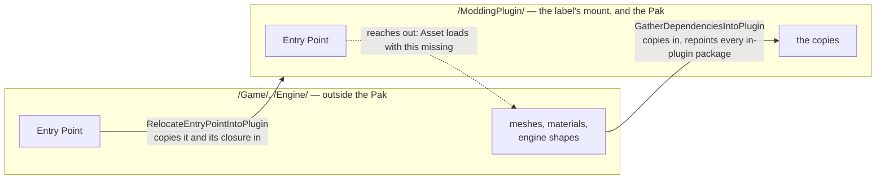

# A Pak holds only its own mount, so the tool gathers dependencies in

> **Corrected 2026-09-04 — the premise below does not hold.** The measurement this ADR rests on was
> taken on a stale Pak: 4 files, the plugin's two maps, cooked before `BP_Hana` was the Entry Point,
> so nothing in it reached outside the mount to begin with. A Pak cooked from chunk 10 with the Entry
> Point actually in the label carries **1921 files across four mounts** — 1324 from the Modding
> Plugin, 421 from the Convai SDK, 166 from engine ControlRig content and 10 from `/Game/`. The
> label's recursive rule does reach across mounts, which is what this repo believed before this ADR.
>
> What follows is kept as written because the reasoning is what the gather was built on and the code
> still behaves this way. What is now open: whether the gather rescues anything, or only duplicates
> content the cook already carries (80 `.uasset` names are in that Pak under two mounts), and where
> the boundary should actually be. See
> [.scratch/overnight-fixes/issues/15-a-pak-carries-more-than-its-own-mount.md](../../.scratch/overnight-fixes/issues/15-a-pak-carries-more-than-its-own-mount.md).

A **Chunk**'s Primary Asset Label gathers the packages under its own mount and nothing else. That is
verified rather than read off the documentation: a built `pakchunk10-Windows.pak` listed exactly two
packages, the **Modding Plugin**'s own `Map.umap` and `NewMap.umap`, and none of the meshes or
materials the level referenced from `/Game/` — despite the label's `bApplyRecursively` rule, which
reads as though the reference closure follows. So the Pak Manager copies every **Source Package** an
**Entry Point** needs from outside the mount to under it, and rewrites what pointed at them, instead
of trusting the label to carry them.

The previous reading was the opposite one — a dependency was "cooked in wherever it lives" — which
made the risk a Pak quietly growing by a folder of test content. The real failure is the reverse and
worse: nothing grows, nothing warns, and the absence is first seen when a Convai product opens the
**Asset** and draws none of it.

Two Commands, because one problem has two shapes. `GatherDependenciesIntoPlugin` is the second: it
leaves the Entry Point where it already belongs, copies only what is outside, and repoints *every*
in-plugin package in the closure rather than the Entry Point alone — a World Partition level keeps
its actors in external packages of their own, and those, not the level, are what hold the references
to the creator's meshes. A gather that repointed only the Entry Point copies correctly and changes
nothing.

## Considered options

- **Skip `/Engine/`, as the relocate Command did.** Rejected: a Convai product cooks the engine
  assets *its own* content references, which is not the set a creator's level needs, so an engine
  reference left outside dangles exactly as a `/Game/` one does. Engine content is copied in like
  any other; the only exclusions left are the Convai SDK's content root and `/ConvaiHTTP/`, which
  every Convai product ships.

## Consequences

- The gather is offered at the pick, in a modal naming the first few packages, and nowhere else.
  **Publish does not re-check**: a creator who drops a `/Game/` mesh into the level after picking it
  publishes a Pak without that mesh, and no step on the publish path says so. The **Dependencies…**
  window reports it to whoever opens it, which is not the same as being told.
- Engine-plugin content is engine content by mount, so a level touching Niagara or Megascans copies
  those in too and the Pak grows by more than a creator expects. Accepted, because the failure on
  the other side is the silent one.
- The originals stay put, so the project holds two copies of everything gathered and the creator
  goes on editing whichever one they opened. Edits to the original never reach the Pak.
- The exception has to be declared. The SDK's content is referenced rather than copied, and Unreal's
  asset reference restrictions reject a reference to a plugin the descriptor does not name, so a
  pick writes the Convai dependency into the Modding Plugin's `.uplugin`. It warns rather than
  refuses when it cannot — a read-only descriptor should not stop a publish.
- No automation test covers the gather. `FCPM_DependencyCopyReport::bReferencesFixedUp` separates
  copies that landed from copies that are actually pointed at, and a false there fails the Command,
  but the evidence that the Pak boundary is where this ADR says it is remains one hand-made pak
  listing.
