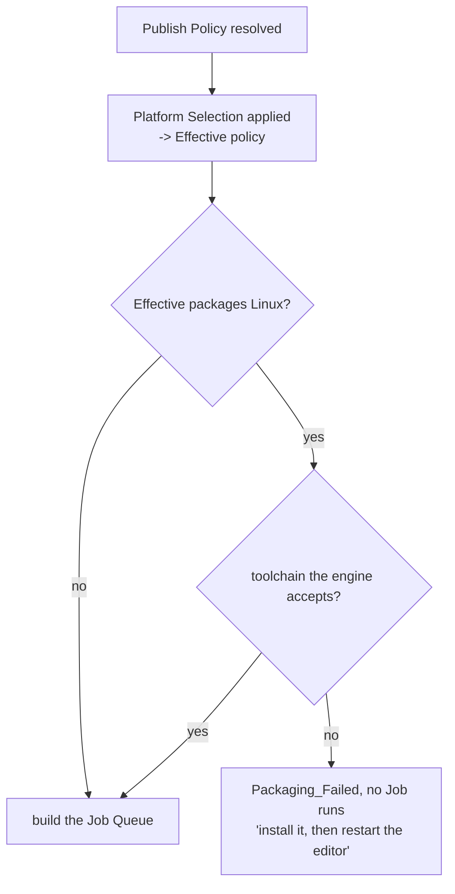

# The tool refuses on facts and warns on guesses

Everything this tool checked about versions warned and let the creator through — the compatibility
banner "tells, never blocks", `FCPM_CompatibilityStatus` fails open on every unread field, and the
legacy-parity register settled item 24 as *warns, does not block* because a creator stopped by an
outdated tool had no way to update it from inside the tool. That stance stands for the checks it was
written about. It does not extend to every check, and this ADR draws the line, because two new ones
refuse.

A **Precondition** refuses. It asks whether this machine can do what a coherent **Publish Policy**
asks, and the answer is a fact read off the host, not an inference about compatibility. The first
one is the Linux cross-compile toolchain: if this Publish packages Linux and no toolchain the engine
accepts resolves, the run is refused in `StartPublishRun` before a single **Job** exists. Every Job
downstream would fail anyway, and the creator would pay a full cook — twenty minutes — to be told.
Refusing costs a second and says the same thing.

The gate is on the **Effective** policy, after the **Platform Selection** is applied, and only on
Linux. A Windows-only publish is never touched by it, however broken the Linux toolchain on that
machine; an enterprise run that *adds* Linux the Policy never asked for is gated exactly like one
the Policy asked for. The condition is "this run is going to build a Linux Pak", nothing else.

The second refusal is a floor, not a comparison. Convai publishes the oldest Pak Manager it will
accept, and below that the publish is refused; above it but behind the newest is still only a banner.
Legacy conflated the two and stopped creators who were fine. "Yours cannot work" is Convai's
published fact; "newer exists" is a guess about whether the newer one matters, and guesses banner.

The engine-target check stays a banner and gains nothing from this ADR, because its subject is
coverage rather than breakage: a **Version** slot is named per engine, so publishing from a
non-target engine adds `ue-5.9-Windows` beside the `ue-5.8-Windows` Convai serves and damages
nothing. The warning exists so a creator knows which engine Convai is migrating to while there is
still time to publish for it.

## Considered options

- **Ask Turnkey for the toolchain verdict.** `ITurnkeySupportModule::GetSdkInfo(FName("Linux"))` is
  Epic's own answer and can never drift from UBT. Rejected on cost: `Status` is `Unknown` until
  something calls `UpdateSdkInfo()`, which shells out `RunUAT Turnkey -command=VerifySdk
  -platform=all` for tens of seconds and no-ops under `FApp::IsUnattended()`. A gate that is
  `Unknown` in the common case fails open and gates nothing; a gate that refreshes first makes the
  publish button pay half a minute before it starts.

- **Port the legacy check as it stood.** It fetched the expected toolchain name from
  `modding_tool_config.json` on GitHub, keyed by `Substring(EngineVersion, 0, 3)`, then asked
  whether `LINUX_MULTIARCH_ROOT` *contained that string* and otherwise probed
  `C:\UnrealToolchains\<name>`. Rejected as a wrong mirror of `LinuxPlatformSDK.cs`: it never reads
  `ToolchainVersion.txt`, which is where UBT reads the installed version; it knows nothing of the
  in-tree SDK under `Engine/Extras/ThirdPartyNotUE/SDKs` or of AutoSDK under `UE_SDKS_ROOT`, both of
  which UBT accepts, so a creator with a working toolchain is sent to a download page; its version
  test passes on any path that merely spells the name; the key breaks at engine 5.10; and when the
  fetch fails the expected name is empty, `Contains(anything, "")` is true, and the check reports
  success having verified nothing. As a warning that was untidy. As a gate it would refuse working
  machines and pass broken ones.

- **Have the Precondition repair the environment.** Legacy wrote `LINUX_MULTIARCH_ROOT` when it
  found a toolchain the variable did not name, and that write was load-bearing rather than cosmetic:
  packaging goes through `UATHelperModule` and `FMonitoredProcess`, so UAT inherits the editor's
  environment block and a variable set here is a variable UAT sees. Rejected anyway. It is the same
  property that makes the refusal honest — a creator who installs the toolchain mid-session has an
  editor whose environment is stale, so UAT's would be stale too and the build would genuinely fail.
  "Restart the editor" is the true answer, and a check that reads is easier to trust than one that
  writes.

## Consequences

- The toolchain rules are mirrored, not called. `Linux_SDK.json`'s `MinVersion`/`MaxVersion`, the
  three ways `GetSDKLocation` resolves a directory, and `ToolchainVersion.txt` as the version's home
  are all read directly, so a future engine that changes any of them leaves this check reading the
  old rule. It is pinned by unit tests over the parsing, not over the engine's behaviour, and
  `Engine/Config/Linux/Linux_SDK.json` moving is the failure nobody would notice.

- A refusal is only as good as the Policy that triggered it. A Policy read that failed already fails
  the run before this, so the Precondition never sees one; but a Policy that legitimately packages
  Linux on a machine with a deliberately unusual toolchain layout — a symlinked SDK, a hand-built
  clang — is refused where UBT might have coped. There is no override.

- The version floor does nothing until Convai publishes one. `min-pak-manager-version` does not yet
  exist in the Modding Tool's `Version.json`; until it does the field reads empty, the floor is
  unset, and only the banner appears. That is the intended failing-open state and not a bug to fix
  from this side.

- Two checks now share a banner slot with different lifetimes: the compatibility fields come from
  two GitHub reads and the toolchain verdict from the local disk. The toolchain one is re-read with
  the policy rather than on paint, so a creator who installs the toolchain and restarts sees the
  banner clear on the next policy refresh, not instantly.
