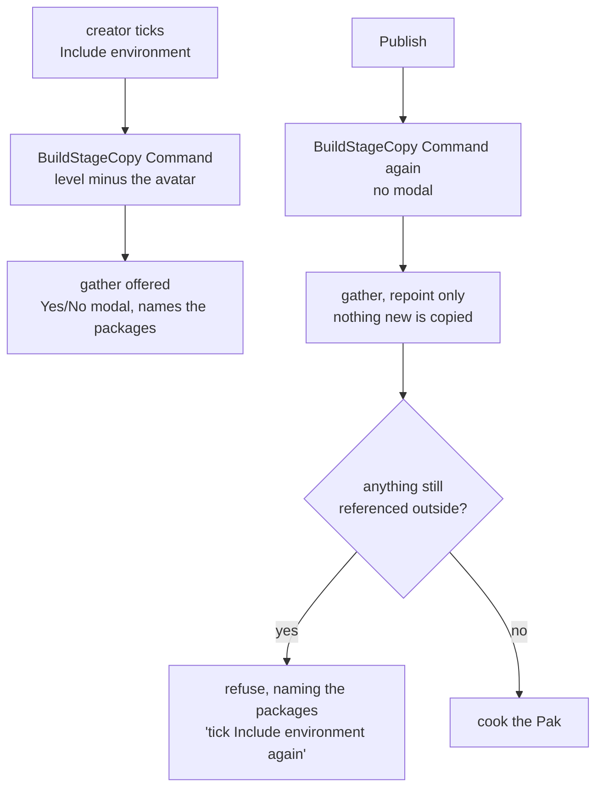

# The stage copy is a Command the Publish re-runs

A **Stage** is the creator's surroundings shipped beside an Avatar — a copy of the level the Avatar
was authored in with the Avatar actor taken out, saved under the **Modding Plugin** at
`/<Plugin>/Stage/<Level>_Stage`, so a Convai product can stream it in around the avatar it spawns,
at the transform recorded with it. See [CONTEXT.md](../../CONTEXT.md).

One **Command** builds that copy and repoints its dependencies into the plugin, and it runs twice.
The creator's *Include environment* tick runs it first, with the gather offered in the same Yes/No
modal the **Entry Point** pick already uses (D11, 2026-09-08). The **Publish** runs the same Command
again with no modal at all: it rebuilds the copy, repoints only — nothing new is copied — and
refuses the publish when any package the copy still reaches sits outside the mount, naming the
packages it found.

That amends two statements by name. CONTEXT.md's **Publish** entry says a Publish "publishes the
Chunk as it finds it — nothing is copied under the label's mount that was not already there"
([CONTEXT.md](../../CONTEXT.md)); ADR-0011's first consequence says "The gather is offered at the
pick, in a modal naming the first few packages, and nowhere else. Publish does not re-check"
([0011](0011-a-pak-holds-only-its-own-mount.md)). Both still hold for the **Chunk** and for the
**Entry Point**: no publish copies a `/Game/` mesh under the mount because a creator dropped one
into their level, and the pick is still the only place a creator is asked. Neither holds for a
Stage. A Stage is not something a Publish finds — it is something a Publish makes, and what it makes
has to be what ships.

That is the whole argument. The tick is where a creator is shown facts about their level — a texture
over the limit, two cameras, a missing Nav Mesh Bounds Volume — and where the avatar's transform is
recorded into `Stage_N.json`, and both of those are promises about a particular set of bytes.
[ADR-0014](0014-the-tool-refuses-on-facts-and-warns-on-guesses.md) has the tool refusing on facts
and warning on guesses; a fact read off a copy the source level has since outgrown is not a fact
about what ships, it is a guess wearing a fact's clothes. A creator who ticks the box, then moves
the avatar and drops a mesh in, would publish a stage that disagrees with its own record, and no
step would say so — the first place it shows is the product.

Which leaves the two triggers doing different jobs. The tick is where a creator is asked, so the
modal belongs there: copying `/Game/` packages under someone's mount without asking is the surprise
the pick-time modal was built to prevent. The publish is where nothing may be silently copied, so
there the Command may only repoint what the tick already brought in, and must refuse rather than
help itself.

## Considered options

- **Copy and gather silently at the publish only.** One trigger, no drift possible, nothing to keep
  in step. Rejected: the creator is never asked, and the publish would copy `/Game/` packages under
  the label's mount unasked — exactly the surprise the pick-time modal exists to prevent. A Publish
  that helps itself to a creator's content is worse than one that refuses.

- **Copy at the tick only, and let the Publish go on publishing the Chunk as it finds it.** Both
  amended statements would stand as written. Rejected: after any edit to the source level the record
  and the bytes drift apart, and every refusal ADR-0014 promises is then computed from stale bytes.
  Nothing reports the drift, so the first sight of it is a Convai product drawing the wrong room.

- **Refuse the publish when the level changed since the tick, instead of regenerating.** Rejected:
  it charges the creator a re-tick for every edit, and it only catches the edits the tool can see —
  a package saved from outside the editor, a material changed under an untouched mesh, all pass.
  Regenerating costs the same copy the tick already paid for and cannot miss an edit.

- **Make it a step of the Publish rather than a Command.** Rejected: a **Job** exists only inside a
  **Job Queue**, so the tick, which starts no Publish, could not run one, and the same rule would
  need a second implementation to be reachable from the tick at all. A Command is identical
  whichever caller asks for it, which is the property this decision leans on.

## Consequences

- The gather now runs twice per stage, and today's gather is not idempotent: a pre-existing copy
  counts as copied and `bReferencesFixedUp` reports a fix-up that did not happen
  ([issues/02](../../.scratch/overnight-fixes/issues/02-copy-into-plugin-copies-nothing.md)). The
  publish's refusal is only as truthful as that report, so it cannot be relied on until the gather
  is hardened — and it is the run with no creator watching it.
- Two rules live side by side. The Publish is still "as it finds it" for the **Chunk** and is not
  for a Stage, so a reader meets the general rule first and the exception second; CONTEXT.md carries
  the exception in its Relationships rather than the **Publish** entry being reworded.
- A publish can refuse over a reference nobody was asked about, because the creator added it after
  the tick and no modal ever named it. The refusal names the packages, which is the "told, not
  merely reported" standard ADR-0011 wished for when it wrote that the **Dependencies…** window
  reports to whoever opens it.
- The copy under `Stage/` is regenerated on every publish, so hand edits to `<Level>_Stage` are
  lost. A creator edits the source level and the copy is an artefact; one Info line says so, and
  nothing else defends it.
- ADR-0011's "nowhere else" now reads as "nowhere else for the **Entry Point**". That sentence is
  not edited where it stands — this ADR is where the exception lives, and 0011's reasoning is still
  what the gather was built on.
- No automation test covers the two runs. They touch real packages and a real world, so nothing here
  runs under `-NullRHI`; the evidence is a checklist row — publish twice, second gather says "N
  already there" — which is the same evidence gap ADR-0011 admits to for the gather itself.
